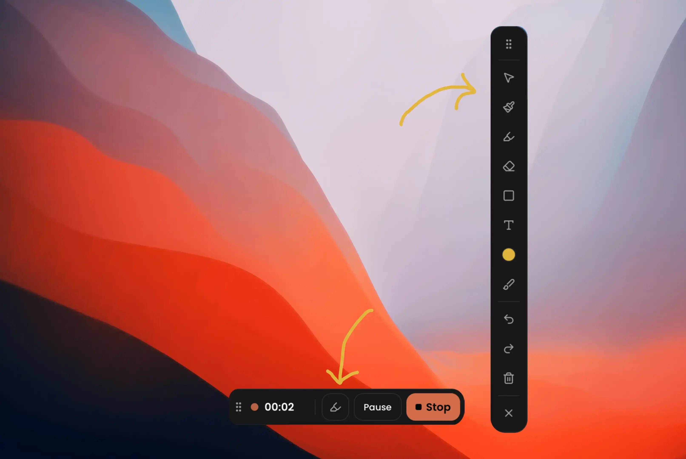
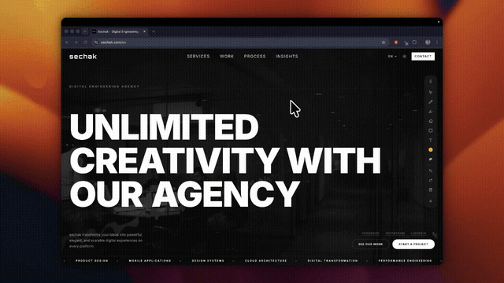
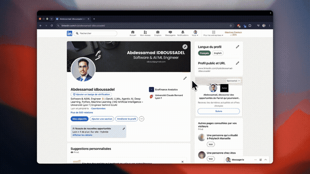
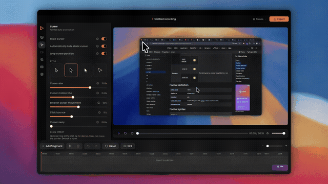
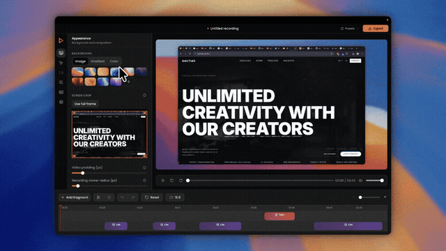
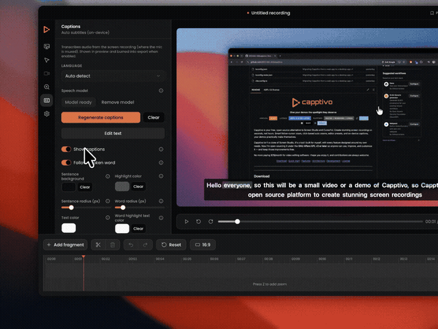
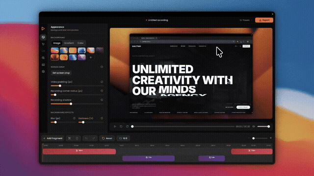

<p align="center">
  
</p>

<p align="center">
  <strong>Give your demos the spotlight they deserve
</strong>
</p>

<p align="center">
  
  
  
  
  
  
</p>

<p>
  Capptivo is your free, open-source alternative to Screen Studio and Cursorful. Create stunning screen recordings in seconds, not hours. Smart follow-cursor zoom, click-based auto zooms, editor presets, and on-device captions, your demos practically make themselves.
</p>

<p>This is an independently maintained modification of MIT-licensed software. The required copyright and license notices are in <a href="LICENSE">LICENSE</a>.</p>

<p align="center">
  <a href="#download">Download</a>
  ·
  <a href="#quick-start">Quick start</a>
  ·
  <a href="#features">Features</a>
  ·
  <a href="#architecture">Architecture</a>
  ·
  <a href="#development">Development</a>
  ·
  <a href="#license">License</a>
</p>

---

## Download

No installer for this modified version has been published yet. Build from the
[current source](#quick-start) to use its changes.

| Platform            | What to grab                                               |
| ------------------- | ---------------------------------------------------------- |
| macOS Apple Silicon | `aarch64` / `aarch64-apple-darwin` `.dmg` or `.app.tar.gz` |
| macOS Intel         | `x64` / `x86_64` `.dmg` or `.app.tar.gz`                   |
| Windows             | `.msi` or `*-setup.exe`                                    |
| Linux               | `.deb` / `.AppImage` / `.rpm`                              |

macOS builds are currently **unsigned**. On first launch: right-click → **Open**,
or allow Capptivo under System Settings → Privacy & Security. Grant **Screen
Recording** when prompted, then relaunch.

Captions need a system [whisper.cpp](https://github.com/ggerganov/whisper.cpp)
`whisper-cli` binary; the app downloads the model weights on first use.

### Maintainers: cutting a release

GitHub Actions builds macOS (Intel + Apple Silicon), Windows, and Linux
installers — no local Windows/Linux machines needed.

1. Bump `version` in `package.json`, `src-tauri/tauri.conf.json`, and
   `src-tauri/Cargo.toml` (keep them identical).
2. Commit and push to `main`, then tag and push the tag (must match the
   version, e.g. `0.1.0` → `v0.1.0`):

```bash
git tag v0.1.0
git push origin main
git push origin v0.1.0
```

3. The [Release](https://github.com/hajimeno-ipoo/capptivo-next/actions/workflows/release.yml)
   workflow builds all platforms and opens a **draft** GitHub Release with the
   installers attached. Review the draft, then publish it.

You can also run the workflow manually from the Actions tab
(`workflow_dispatch`) without pushing a tag.

**Updater setup:** this repository has its own Tauri updater public key in
`src-tauri/tauri.conf.json`. Before publishing a release, securely back up the
matching private key from `src-tauri/.updater-keys/capptivo.key` and set the
`TAURI_SIGNING_PRIVATE_KEY` GitHub Actions secret. Never commit the private key.
Until a release is built with that key, automatic updates are unavailable.

**Signing:** builds are unsigned for now. macOS users may need right-click →
Open once. When you have Apple / Windows certificates, add the usual Tauri
signing secrets (`APPLE_CERTIFICATE`, `APPLE_CERTIFICATE_PASSWORD`,
`APPLE_SIGNING_IDENTITY`, `APPLE_ID`, `APPLE_PASSWORD`, `APPLE_TEAM_ID`,
and/or Windows `TAURI_SIGNING_*`) in the repo Settings → Secrets.

**Permissions:** if the workflow fails with “Resource not accessible by
integration”, set Settings → Actions → General → Workflow permissions to
**Read and write**.

---

## Platforms

Capptivo runs on:

- **macOS** 13.0+
- **Windows** 10 build 1903+ (May 2019 Update)
- **Linux** on modern distros with PipeWire 1.0+ (e.g. Ubuntu 24.04+) — X11 and Wayland

Platform notes:

- **macOS** captures through native **ScreenCaptureKit** with **VideoToolbox** hardware
  H.264 encoding; system audio comes from a companion SCK stream.
- **Windows** captures through native **Windows.Graphics.Capture**, with hardware
  encoding probed per machine (NVENC / QuickSync / AMF / Media Foundation) and
  system audio via **WASAPI loopback**.
- **Linux** captures through **xdg-desktop-portal + PipeWire** — the screen/window is
  picked in the system dialog. System audio comes from the PulseAudio/PipeWire
  monitor. Cursor replay / follow-zoom use an X11 pointer probe on X11 sessions,
  and PipeWire cursor **Metadata** on Wayland when the portal supports it
  (otherwise the cursor is embedded in the recording and zoom-follow is unavailable).
  Area selection isn't available yet on Linux — crop in the editor instead.

---

## Quick start

```bash
pnpm install
pnpm tauri dev
```

Requires **Rust**, **Node**, and **pnpm**. FFmpeg is fetched automatically as a
per-platform sidecar on first dev/build (`scripts/fetch-ffmpeg.mjs`), installed
as `capptivo-ffmpeg` / `capptivo-ffprobe` so Linux packages do not collide with
the system `ffmpeg` package.

macOS: grant Screen Recording in System Settings on first launch, then relaunch.  
Open the recorder with **⌥⇧R** (**Alt+Shift+R** on Windows/Linux), or click the tray icon.

---

## Features

### Recording

- Menubar recorder with global hotkey (**⌥⇧R**)
- Capture display, window, or custom area (with live frame guide)
- Face-cam overlay while recording
- Microphone capture (device picker)
- System audio capture
- Language switch (English / Français / Español / Italiano / Deutsch / Português / Русский / 日本語 / 한국어 / 中文 / العربية)
- Countdown before start
- Pause / resume
- On-screen annotations while recording
- Native pipeline per OS (ScreenCaptureKit / Windows.Graphics.Capture / PipeWire) → hardware H.264 → crash-safe fragmented MP4
- 60 Hz cursor + click track saved with the project (`cursor.json`)




### Annotations

Draw on top of the screen while recording — floating toolbar, click-through when idle.

- Select tool (pass clicks through to the desktop)
- Pen and highlighter
- Eraser
- Shapes: rectangle, ellipse, line, arrow
- Text
- Color palette + custom picker
- Brush size
- Undo / redo / clear all
- Draggable toolbar; Escape peels panels then closes



### Zoom & motion

- Zoom fragments on the timeline (add with **Z** or Add fragment)
- **Auto-suggest zooms** from clicks when you open a fresh recording (or Add fragment → Suggest zooms)
- Follow-cursor zoom (pans with the pointer)
- Fixed zoom regions (drag / resize the frame)
- Scope: recording only or full scene (background included)
- Scale, pan smoothness, ease in / ease out
- Shrink background padding during zoom
- Shrink face-cam during zoom (size at peak zoom)
- Automatic motion between fragments



### Cursor

- Show / hide composited cursor
- Styles: macOS, Tahoe, Tahoe inverted, Minimal
- Cursor size
- Motion blur
- Click bounce + bounce speed
- Cursor sway
- Generated click sound with adjustable volume



### Look & composition

- Backgrounds: image presets, gradients, solid colors, or upload your own
- Custom gradient angle / colors
- **Named editor presets** — save / apply look, face cam, cursor, captions, and export settings
- Screen content crop (hide chrome / clutter)
- Video padding
- Recording corner radius
- Recording shadow
- Background blur
- Background darkness
- Highlight color and opacity for time-bounded highlights
- Text clips can be positioned by dragging their preview box; font choices come from the host OS



### Face cam

- Round or rectangular PiP
- Mirror webcam
- Corner position + margin from the frame edge
- Size / width / height
- Roundness (rectangular)
- Shadow intensity
- Crop face cam
- Layout that stays in sync with zoom (optional shrink during zoom)

### Captions

- On-device speech-to-text (Whisper via whisper.cpp)
- Downloadable model, no cloud required
- Generate, style, and burn captions into preview + export



### Timeline

- Scrub and play the composition
- Zoom fragments (add, suggest from clicks, select, resize, split, delete)
- Time-bounded blur masks and highlights (add, move, resize, split, delete)
- Text clips with editable content, host-OS font, color, size, position, and timeline interval
- Drag a text clip directly in the preview; the position sliders remain available for fine adjustment
- Whole-video speed and time-bounded speed ranges (0.25×–4×)
- Auto typing ×2 speed ranges from recorded text-cursor spans
- Trim gaps (add with **T**)
- Undo / redo
- Timeline zoom (auto / manual)
- Reset fragments

### Export

- Formats: MP4, WebM, GIF
- Resolution presets (low → original)
- Encoding quality / GIF color quality
- Frame rate (24 / 30 / 60)
- Optional voice enhancement (podcast)
- Progress UI, save dialog, notification + reveal in Finder / Explorer / file manager



### Local-first

- Projects stored in the OS app-data directory (Application Support / AppData / XDG)
- In-app recordings library
- Rename projects
- No account required to record or edit
- UI languages: English, Français, Español, Italiano, Deutsch, Português, Русский, 日本語, 한국어, 中文, العربية

---

## Architecture

```
Capture  →  bounded frame channel  →  FFmpeg / VideoToolbox  →  screen.mp4
Cursor   →  cursor.json
UI       →  typed IPC projection of Rust state
Editor   →  media:// (HTTP Range) + canvas compositor → export
```

Rust owns capture, encoding, and storage. The React shell is presentation only — domain modules never import `tauri::*`.

```
src-tauri/src/
├── recorder/     # CaptureBackend → encoder (no Tauri)
├── cursor/       # 60 Hz pointer tracker (CoreGraphics / Win32 / X11)
├── project/      # local store + schema
├── commands/     # thin IPC adapters
└── …             # tray, windows, media protocol
```

---

## Development

```bash
pnpm tauri dev                 # app + Vite
cd src-tauri && cargo test --no-default-features
cargo check --no-default-features
```

---

## License

Capptivo Desktop is released under the [MIT License](LICENSE) (`MIT`). You are
free to use, copy, modify, merge, publish, distribute, sublicense, and sell
copies of the software, provided the copyright notice and permission notice
are included in all copies or substantial portions of it.

The software is provided **"AS IS", WITHOUT WARRANTY OF ANY KIND**, express or
implied. See [LICENSE](LICENSE) for the full text.

Bundled and downloaded third-party components (notably the FFmpeg sidecars,
which are GPL-licensed) have their own licenses and are **not** covered by
Capptivo's MIT license — see [THIRD_PARTY_NOTICES.md](THIRD_PARTY_NOTICES.md)
for what that means if you redistribute builds.

By contributing, you agree that your contributions are licensed under the
same terms (`MIT`).
